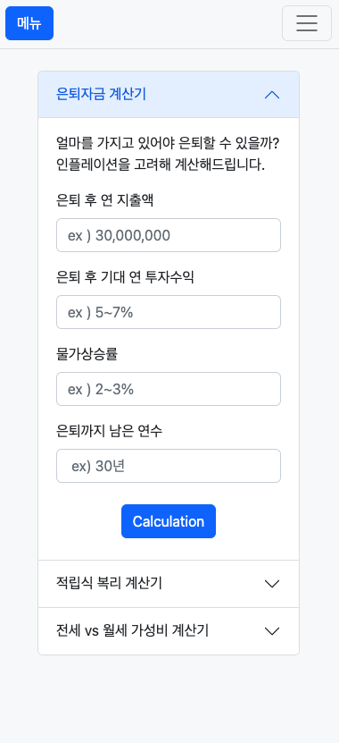
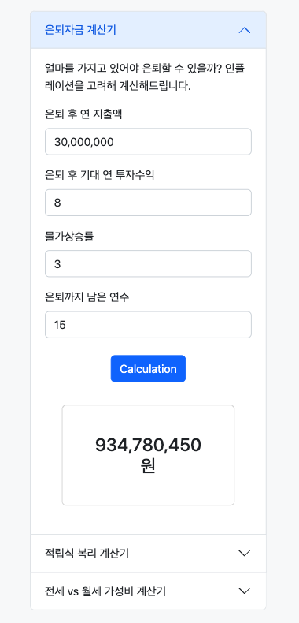
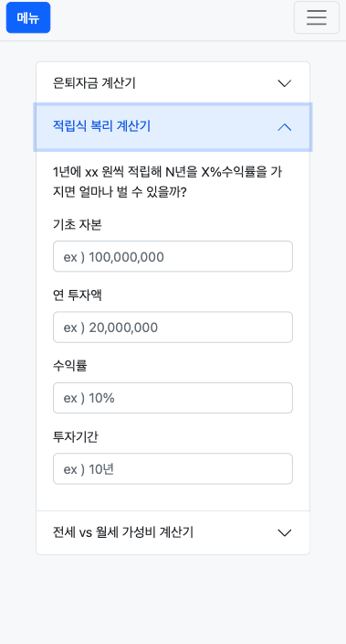
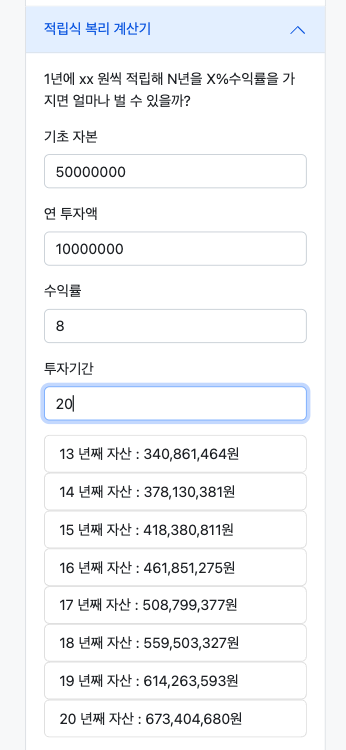
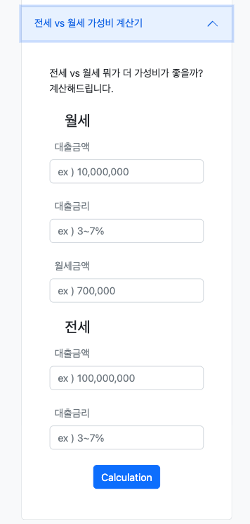
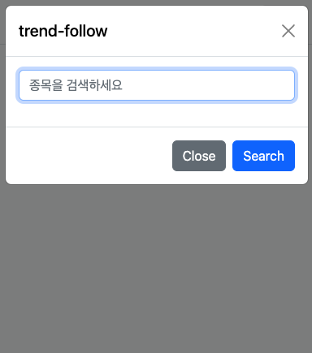
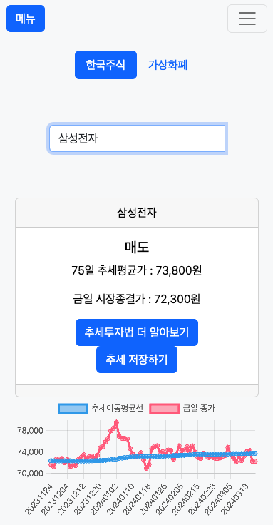

# QUANT_BOT

퀀트투자를 쉽게 접할 수 있게 해주는 웹어플리케이션 퀀투봇 입니다.

Quantobot is a web application that makes quantitative investing accessible.

- ### github : https://github.com/MeotJH/quant_bot
- ### web-app : http://quant-bot.iptime.org

### 📚 목차 index

- 개요 Outline
- 개발환경 Development
- 사용법 How to use

## 🔈 개요 Outline

수학과 통계를 기반으로 전략을 만들고 이를 바탕으로 투자하는 정량적인 투자법을 의미하는 퀀트투자는 인간의 주관이 들어가지 않는다는 점에서 장점이된다.
왜냐하면, 시장을 상대할때 우리의 주관이 많이 반영되면서 하게되는 손실회피 편향, 확증 편향과 같은 많은 오류들이 존재하기 때문이다.

하지만 퀀트투자는 투자를 할때 정량적인 계산이 들어간다는 점에서 불편하고 계산의 실수가 존재할 수 있다.
무엇보다 정량적인 계산은 컴퓨터가 제일 잘 하는 영역이고 이런 퀀트투자 방법을 작성해두고 우리는 사용만 할 수 있게 된다면, 퀀트투자에 있어
몇가지 단점이 사라지고 시장의 상황에 상관없이 기계적인 투자를 하기에 더욱 용이하다.

앞서말한 편리함으로 더 나은 투자생활을 만들기 위해 퀀투봇을 만들게 되었고 좋은 영향력을 주길 바란다.

## ⚙️ 개발환경 Development

- BackEnd : Spring
- FrontEnd : Vue (client-side) by Cdn, BootStrap, Thymeleaf (sever-side)
- Databse : ORM(JPA), H2(local,development-enviroment), PostgreSQL (production-enviroment)
- CI/CD : gitHub, jenkins, linux
- Test : Junit5
- ETC : JWT, OAuth2.0(카카오 간편로그인)

## 사용법 How to use

- 메인화면 :

  - 한국경제 뉴스를 가져온 뉴스 데이터를 보여준다.

    </img>

- 한국 코스피 및 코스닥의 금일 시장 주가를 가져온다.

  </img>

---

- 금융 공학 계산기
  - 
  - ### 은퇴자금 계산기
</img>
  - 은퇴 후 1년간 지출할 지출액 (3천만원)
  - 은퇴 후 투자수익으로 얻을 기대수익 (8%)
  - 물가상승률 보수적으로 (3%)
  - 현재로 부터 은퇴까지 남은 년수를 입력 (15년)
  - **결과값으로 934,780,450원 9억3천만원 정도가 나온 모습**

</img>
  - ### 적립식 복리 계산기
</img>

주식투자는 복리로 수익률이 오른다 그렇다면 **현재 5천만원을 가지고 있고 1년에 1000만원씩 주식투자해서 매년 8%수익이 난다면 20년 후엔 얼마가 될까?** 를 계산해준다.

 </img>
  
  - ### 전세 vs 월세 가성비 계산기
    - 전세와 월세중 지금 어디에 살아야 가성비가 좋을까?
  
</img>

---

- 추세추종 투자법
  - 

  - 메뉴에 들어가서 원하는 주식명을 입력한다.

    - 메뉴 들어가는 모습 [ 현재 **한국주식**, **암호화폐** 가능 ]

    </img>

    - 검색 모달이 띄워지는 모습

    </img>

    - 검색해 원하는 종목명을 파악하는 모습

    </img>

  - 검색한 종목에 대한 정보와 차트가 표현된다.

    - 추세추종 투자법에 따라 금일 매도가 추천되었다.

    </img>

    - 파란색인 추세선과 빨간색인 90일간의 종가를 파악해 매매에 대한 정보를 얻을 수 있다.

    </img>
